# OpticalDrop

**Send files through light.** No Wi-Fi. No Bluetooth. No pairing. Just a screen and a camera.


## Overview

OpticalDrop is a production-ready web application that transfers files between two devices using **only a screen and a camera**. The sender displays an animated sequence of QR codes containing chunks of the file. The receiver uses its camera to scan those QR codes and reconstruct the original file.

### Core Principle

The file payload travels exclusively through:
```
Sender Screen → Light → Receiver Camera → QR Decoder → File Reconstruction
```

**The file never passes through:**
- Wi-Fi/network connections
- Bluetooth
- WebSockets
- WebRTC
- Cloud storage
- External APIs
- Any backend server

## Features

- **🔒 Privacy First** - Files never leave your devices
- **📶 No Network Required** - Works completely offline
- **🔄 Error Correction** - Parity-based forward error correction recovers lost frames
- **✅ Integrity Verified** - SHA-256 checksum ensures bit-for-bit identical files
- **⚡ Adaptive Speed** - 4 transmission presets (2-20 FPS)
- **📱 Mobile Optimized** - Rear camera support, responsive UI
- **🧪 Demo Mode** - Test without two physical devices
- **🐳 Docker Ready** - One-command deployment

## Architecture

```mermaid
graph TB
    subgraph Sender["Sender Device (Browser)"]
        SF[File Selection] --> CP[Chunk & Encode]
        CP --> QRG[QR Frame Generator]
        QRG --> QRD[QR Display Engine]
    end

    subgraph Channel["Optical Channel"]
        QRD -->|Light| CAM[Camera Capture]
    end

    subgraph Receiver["Receiver Device (Browser)"]
        CAM --> QRS[QR Scanner Worker]
        QRS --> FV[Frame Validator]
        FV --> RF[File Reconstruction]
        RF --> CV[Checksum Verification]
        CV --> DL[Download File]
    end

    subgraph Backend["Backend (Optional)"]
        HC[Health Check]
        CFG[Config API]
        AN[Anonymous Analytics]
    end

    style Sender fill:#1a1a2e
    style Channel fill:#0f0f1a
    style Receiver fill:#1a1a2e
    style Backend fill:#16213e
```



## Project Structure

```
optical-drop/
├── client/                 # React + TypeScript + Vite
│   ├── src/
│   │   ├── components/     # UI components (sender, receiver, QR, ui)
│   │   ├── features/       # Feature modules
│   │   ├── lib/            # Core libraries (qr, protocol, crypto, encoding, fec)
│   │   ├── workers/        # Web Workers (QR decoder)
│   │   ├── stores/         # Zustand state management
│   │   ├── hooks/          # Custom React hooks
│   │   ├── pages/          # Page components
│   │   └── utils/          # Utilities
│   └── package.json
├── server/                 # Express + TypeScript + MongoDB
│   ├── src/
│   │   ├── routes/         # API routes
│   │   ├── controllers/    # Route controllers
│   │   ├── models/         # Mongoose models
│   │   ├── services/       # Business logic
│   │   └── middleware/     # Express middleware
│   └── package.json
├── shared/                 # Shared TypeScript types
│   ├── protocol/           # Protocol implementation
│   ├── types/              # Type definitions
│   └── constants/          # Constants & config
├── docker-compose.yml
└── package.json            # Root workspace
```

## Quick Start

### Prerequisites

- Node.js 20+
- MongoDB 7+ (or Docker)
- npm 10+

### Development

```bash
# Clone and install
git clone <repo>
cd optical-drop
npm install

# Start MongoDB (if not using Docker)
npm run db:start

# Start development servers
npm run dev
```

This starts:
- Client: http://localhost:5173
- Server: http://localhost:3001

### Production Build

```bash
npm run build
npm run start
```

### Docker Deployment

```bash
# Build and start all services
docker-compose up -d --build

# View logs
docker-compose logs -f

# Stop
docker-compose down
```

## Usage

### Sending a File

1. Open http://localhost:5173 on sender device
2. Click **"Send a File"**
3. Drag & drop or select a file (max 500MB)
4. Configure settings (chunk size, redundancy, speed)
5. Click **"Start Transmission"**
6. QR codes will animate on screen

### Receiving a File

1. Open http://localhost:5173 on receiver device
2. Click **"Receive a File"**
3. Grant camera permission (uses rear camera on mobile)
3. Point camera at sender's screen
4. Fill the frame with QR code
5. File reconstructs automatically
6. Click **"Download File"** when complete

### Transmission Speeds

| Preset | FPS | Frame Delay | Best For |
|--------|-----|-------------|----------|
| Compatibility | 2 | 500ms | Low light, old devices, distance |
| Balanced | 5 | 200ms | **Default** - most situations |
| Fast | 10 | 100ms | Good lighting, modern devices |
| Extreme | 20 | 50ms | Perfect conditions, testing |

### Tips for Reliable Transfer

- **Maximize screen brightness** on sender
- **Use rear camera** on receiver (mobile)
- **Fill the frame** with QR code
- **Keep devices steady** and parallel
- **Avoid glare** and reflections
- **Reduce speed** if frames are missed

## Protocol Details

### Frame Structure

Each QR frame contains a JSON payload:

```json
{
  "protocolVersion": 1,
  "transferId": "od_1xk9m2p_abc123def",
  "frameIndex": 142,
  "totalFrames": 1800,
  "payload": "SGVsbG8gV29ybGQh...",
  "checksum": "a1b2c3d4",
  "frameType": "data"
}
```

### Frame Types

| Type | Purpose | Position |
|------|---------|----------|
| `metadata` | File info (name, size, checksum, etc.) | Frame 0 |
| `data` | File chunks (Base64 encoded) | Frames 1..N |
| `parity` | XOR parity for error correction | Frames N+1..N+P |
| `complete` | End-of-transfer marker | Last frame |

### Error Correction

- **Parity chunks** generated via XOR of data chunk groups
- **Configurable redundancy**: 10% (Low), 20% (Medium), 30% (High)
- **Single chunk recovery** per parity group
- **Duplicate detection** via frame index tracking
- **Out-of-order support** - frames can arrive in any sequence

### Integrity Verification

1. Sender computes SHA-256 of entire file
2. Checksum included in metadata frame
3. Receiver reconstructs file and recomputes SHA-256
4. Transfer succeeds only if checksums match exactly

## API Reference

### Health Check
```
GET /api/health
```
Returns server status, uptime, database connection.

### Configuration
```
GET /api/config
```
Returns protocol version, max file size, defaults.

### Analytics (Anonymous)
```
POST /api/analytics
GET /api/analytics/summary
```
Records aggregate transfer statistics (no file data).

## Configuration

### Environment Variables

**Server (.env)**
```env
PORT=3001
NODE_ENV=development
MONGODB_URI=mongodb://localhost:27017/optical-drop
CLIENT_URL=http://localhost:5173
RATE_LIMIT_WINDOW_MS=900000
RATE_LIMIT_MAX_REQUESTS=100
```

**Client (.env)**
```env
VITE_API_URL=http://localhost:3001/api
```

## Browser Compatibility

| Browser | Sender | Receiver |
|---------|--------|----------|
| Chrome 90+ | ✅ | ✅ |
| Edge 90+ | ✅ | ✅ |
| Firefox 88+ | ✅ | ✅ |
| Safari 15+ | ✅ | ✅ |
| Chrome Android | ✅ | ✅ |
| Safari iOS | ✅ | ✅ |

> **Note:** Camera API requires HTTPS or `localhost`. For LAN testing, use `mkcert` for local TLS or deploy with Docker.

## Security Model

- **No file data** ever leaves the browser
- **No encryption** of QR payloads (by design - optical channel)
- **Pre-encrypt sensitive files** before transfer (age, GPG, 7-Zip AES-256)
- **Physical security** required - line of sight = potential interception
- **Automatic cleanup** - camera streams, buffers, state cleared on completion

## Performance

- **Chunk size**: 512-2048 bytes (configurable)
- **Throughput**: ~1-50 KB/s depending on speed preset
- **Memory**: Streaming-style processing, no full file duplication
- **Workers**: QR decoding offloaded to Web Worker

## Known Limitations

1. **Line of sight required** - devices must see each other's screen/camera
2. **Speed limited** by camera frame rate and QR decoding latency
3. **No encryption** - payload visible to any camera
4. **File size limit** 500MB (browser memory constraints)
5. **iOS Safari** requires user gesture for camera access

## Future Improvements

- [ ] Reed-Solomon erasure coding (stronger FEC)
- [ ] Adaptive rate control based on frame loss
- [ ] AES-GCM encryption option for QR payloads
- [ ] Progressive quality (multiple resolutions)
- [ ] WebRTC data channel for acknowledgment (optional)
- [ ] Native mobile apps for background scanning
- [ ] Multi-receiver broadcast mode

## Development

### Commands

```bash
# Install all dependencies
npm install

# Run all dev servers
npm run dev

# Run client only
npm run dev:client

# Run server only
npm run dev:server

# Run tests
npm run test

# Run linter
npm run lint

# Format code
npm run format

# Build all
npm run build
```

### Testing

```bash
# Unit tests
npm run test:client

# Integration tests
npm run test:client -- --run integration

# With UI
npm run test:client -- --ui
```

## Contributing

1. Fork the repository
2. Create a feature branch
3. Make your changes
4. Run tests and linting
5. Submit a pull request

## License

MIT License - see [LICENSE](LICENSE) for details.

## Acknowledgments

- [jsQR](https://github.com/cozmo/jsQR) - QR code decoding
- [qrcode](https://github.com/soldair/node-qrcode) - QR code generation
- [shadcn/ui](https://ui.shadcn.com/) - UI components
- [Tailwind CSS](https://tailwindcss.com/) - Styling
- [Framer Motion](https://www.framer.com/motion/) - Animations
- [Zustand](https://github.com/pmndrs/zustand) - State management